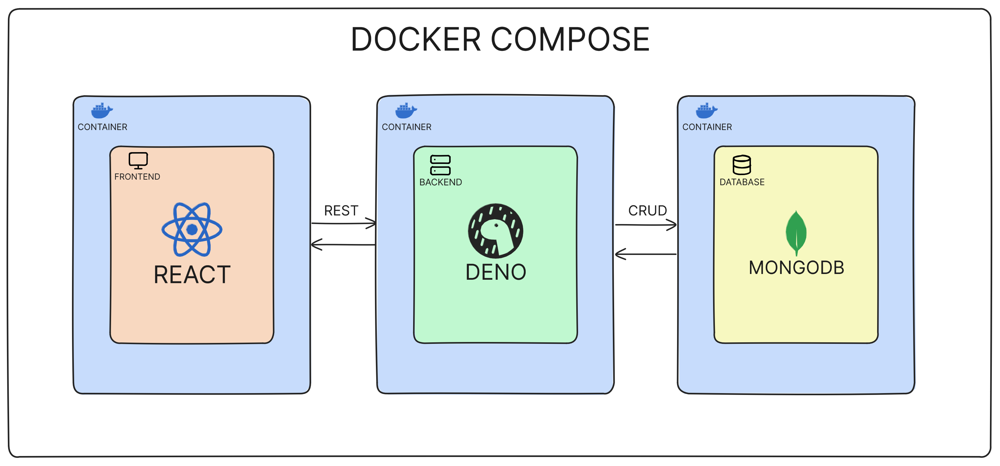

# Task Management App

A fullstack task management application with data persistence

## How to run locally

1. Install [Git](https://git-scm.com/book/en/v2/Getting-Started-Installing-Git).
2. Clone this repository.
3. Install [Docker](https://docs.docker.com/engine/install/) and [Docker Compose](https://docs.docker.com/compose/install/).
4. Start the Docker engine to run as background process.
5. Navigate to repository.
6. Run `docker-compose up --build`.
7. Open `localhost:5173` in a browser.
8. To stop, run `docker-compose down`.

## Tech stack

* Frontend : Vite + React + Typescript
* Backend : Deno + Oak
* Database : MongoDB

## Features

1. Filters for easier management
2. Quick search bar
3. Confirmation modal for deleting a task
4. Data stored on an external database

## System Architecture

